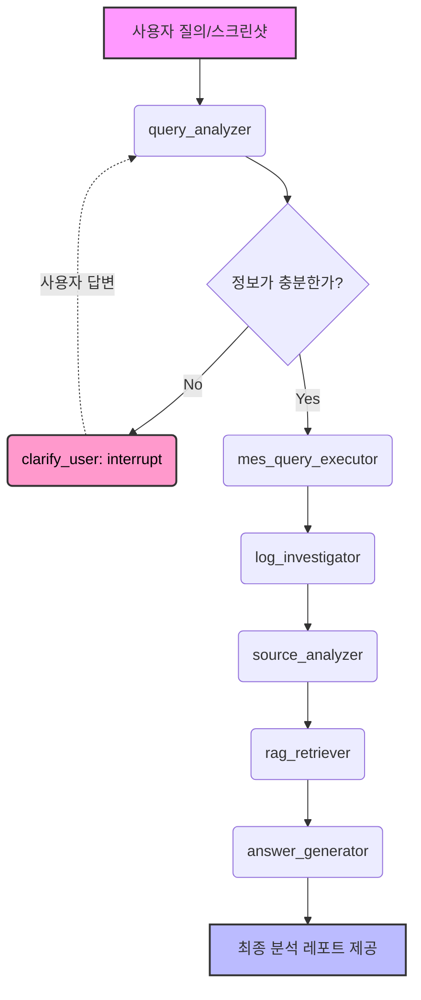

# MES AI Agent: Semiconductor Back-end Manufacturing Expert

반도체 후공정 MES(Manufacturing Execution System) 운영 및 이슈 해결을 위한 지능형 인공지능 에이전트입니다. 이 시스템은 단순한 질의응답을 넘어, 현장의 데이터와 시스템 로그, 실제 소스 코드를 복합적으로 분석하여 문제의 근본 원인을 파악하고 최적의 대응 방안을 제안합니다.

---

## 🏗 시스템 아키텍처 및 설계 (System Architecture)

MES AI Agent는 **LangGraph**를 기반으로 한 상태 중심(Stateful) 멀티 에이전트 워크플로우로 설계되었습니다. 각 단계는 독립적인 노드(Node)로 구성되며, 공유된 상태(State)를 통해 데이터를 교환합니다.

### 🔄 워크플로우 다이어그램 (Workflow)



---

## 🚀 주요 핵심 기능 (Core Features)

### 1. 지능형 멀티모달 분석 (Multimodal Analysis)
- **OpenAI GPT-4o Vision**: 텍스트 질의뿐만 아니라 MES 화면 스크린샷을 동시에 분석합니다.
- **자동 엔티티 추출**: 이미지 속의 에러 메시지, Lot ID, 설비 ID, 화면명 등을 자동으로 인식하여 분석 컨텍스트로 사용합니다.

### 2. Human-in-the-Loop (HITL) - 재문의 기능
- **LangGraph Interrupt**: 필수 정보(예: Lot ID, 설비 ID 등)가 누락된 경우, 시스템은 처리를 강제로 중단하고 사용자에게 추가 정보를 요청합니다.
- **State Persistence**: 사용자가 답변을 제공하면 중단된 지점부터 상태를 복구하여 실행을 재개(Resume)함으로써 대화의 연속성을 보장합니다.

### 3. MCP (Model Context Protocol) 기반 도구 통합
- **Dynamic Tool Selection**: LLM이 문제 해결에 가장 적합한 도구를 스스로 판단하여 호출합니다.
- **MES DB 연동**: `sql_queries.py`에 정의된 안전한 템플릿을 통해 실시간 생산 데이터를 처리합니다.
- **분산 로그 추적**: Elasticsearch와 연동하여 시스템 예외 및 경고 로그를 실시간으로 탐색합니다.

### 4. 소스 코드 레벨 분석 (Source-level Investigation)
- 장애가 발생한 화면이나 API와 연관된 Service/Controller 로직을 리포지토리에서 찾아 직접 분석하여, 데이터 오류인지 프로그램 버그인지 명확히 구분합니다.

### 5. RAG 기반 지식 활용 (Retrieval-Augmented Generation)
- MES 운영 매뉴얼, 표준 가이드라인, 그리고 과거 장애 조치 사례(Incident History)를 벡터 DB에서 검색하여 검증된 해결책을 제시합니다.

---

## 📁 프로젝트 구조 (Project Structure)

```text
mes_ai_agent/
├── agent/                  # 에이전트 핵심 로직
│   ├── nodes/              # 각 단계별 독립 실행 노드 (Analyzer, Executor 등)
│   ├── edges/              # 조건부 라우팅 및 흐름 제어 로직
│   ├── graph.py            # LangGraph 전체 워크플로우 정의 및 컴파일
│   └── state.py            # 에이전트 전역 상태(State) 정의
├── api/                    # 클라이언트 인터페이스
│   └── chat.py             # FastAPI (REST/WebSocket) 및 HITL 처리 로직
├── config/                 # 시스템 설정 및 환경 변수 관리
├── servers/                # 외부 시스템 연동 (MCP Servers)
│   ├── mcp_utils.py        # MCP 도구 및 공통 유틸리티 (Bridge)
│   ├── sql_queries.py      # 비즈니스 SQL 쿼리 중앙 집중 관리
│   └── mes_db_server.py    # MES 데이터 시스템 인터페이스
├── rag/                    # 지식 베이스 관리
│   ├── indexer.py          # 매뉴얼 및 기술 문서 벡터화
│   └── retriever.py        # 컨텍스트 기반 문서 검색
├── docs/                   # 상세 설계 및 기술 문서
└── tests/                  # 품질 검증 스크립트
```

---

## 🛠 설치 및 시작 가이드 (Getting Started)

### 1. 전제 조건
- Python 3.10 이상
- OpenAI API Key

### 2. 설정
`.env` 파일을 작성합니다.
```env
OPENAI_API_KEY=sk-....
LLM_MODEL=gpt-4o
MES_DB_USER=...
ES_HOST=http://localhost:9200
```

### 3. 설치 및 실행
```bash
# 의존성 설치
pip install -r requirements.txt

# 에이전트 서버 실행
python main.py
```

### 4. 기능 검증
```bash
# 단위 및 통합 테스트 실행
pytest tests/test_nodes/test_graph.py

# Human-in-the-Loop 시나리오 직접 검증
python tests/verify_hitl.py
```

---

## ⚖️ 설계 원칙 (Design Principles)

- **Modularity**: 각 도구와 노드는 독립적으로 동작하며 MCP 브릿지를 통해 느슨하게 결합됩니다.
- **Safety**: 직접적인 SQL 코딩을 배제하고 관리된 쿼리셋만 사용합니다.
- **Transparency**: 모든 처리 과정은 `processing_steps` 상태에 기록되어 사용자에게 실시간 진행 상황을 공유합니다.

---
© 2026 MES AI Agent Project. All rights reserved.
